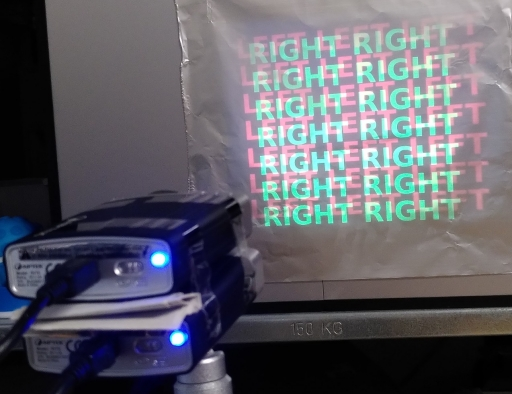
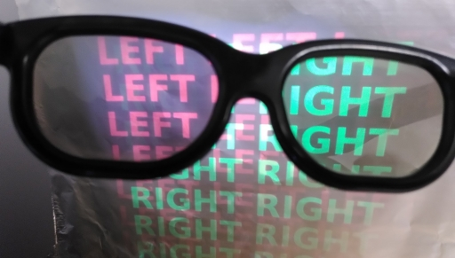
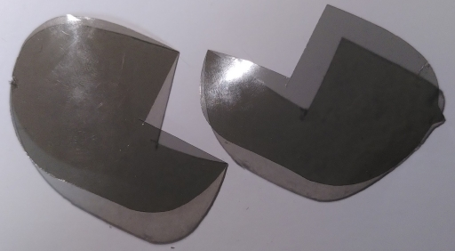
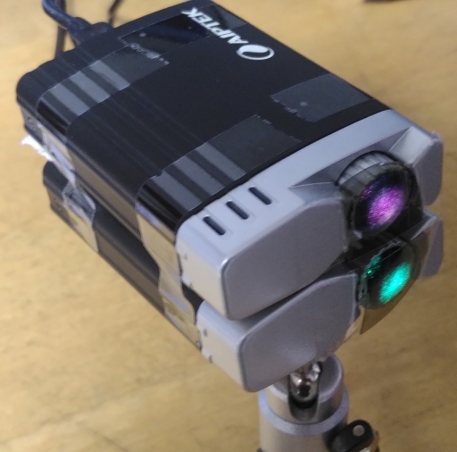

# DIY stereo image and movie projector
## Built of two Aiptek T20 USB projectors

This is a simple 3d projector based on two small Aiptek T20 USB
projectors. The two projectors are stacked onto each other and two
small parts of polarizer cut from cheap/thin polarizer glasses are
taped over the objective lenses of both projectors.


*Stereo image projected with two T20 projectors*

The image can be projected onto any surface that does not destroy
polarization like e.g. a silver screen or the matte side of a piece of
aluminum foil.


*Two stacked T20's*

## Linux udev rules

To give regular applications the permissions to connect to the
T20's via USB a udev rule file is provided [here](udev/45-t20.rules).
Copy this file to ```/etc/udev/rules.d```.

## Viewer

The viewer serves two purposes. It can be used to test a single or
both projectors and it allows for benchmarking to verify that the
refresh rate is sufficient even for both projectors in parallel.

Example stereo images can e.g. be taken from
[StereoPOV](http://stereopov.ichthyostega.de/images.html).

The shell scripts in [viewer](viewer) allow to display single images
or stereo images either from "crossed eye" source or from regular
stereo sources.

```
$ ./view_stereo.sh photonBoxx_full.jps 
-- Aiptek T20 demo application --
Found device on bus 2 device 116.
0xfc01: 02
0xfc6c.w: 3031
0xfc6c.w: 1021
0xfc6c.w: 3021
0xfc6c.w: 3031
0xfc6c.w: 3021
ok
Found device on bus 1 device 89.
0xfc01: 02
0xfc6c.w: 0001
0xfc6c.w: 1001
0xfc6c.w: 3021
0xfc6c.w: 3031
0xfc6c.w: 3021
ok
Running 250 frame performance test ... 5.36s
Bytes/sec = 85986191 (656 mbit/s)
  => 46.650494 frames/sec
```

## Mplayer

Also available is a patch against mplayer-1.3.0. This adds an output
driver for the T20 to mplayer. If more than one T20 is detected, then
a stereo mode is activated and the video to be replayed is expected to
be stereoscopic, either side-by-side vertically or horizontally. The
t20 driver tries to figure out automatically which alignments the
images have.

On a ubuntu system a matching mplayer can be built like so:

```
apt-get source mplayer
sudo apt-get build-dep mplayer
cd mplayer-1.3.0
patch -p1 <../mplayer_1.3.0_t20.patch
dpkg-buildpackage -rfakeroot -uc -b
```

This will build debian packages installable on your system.

Example vidoes can e.g. be found
[here](https://www.3dtv.at/Movies/). Videos should be scaled to the
projector size of 640x480. So the [3D Film Peschke Macroshow
09](https://www.3dtv.at/Movies/Macroshow_en.aspx) can be replayed
using the command:

```
mplayer -vo t20 -vf scale=640:-2 Peschke\ Macroshow\ 576p\ \(Wide\).wmv
```

And the [3d version of big buck bunny](https://mirrors.kodi.tv/demo-files/BBB/bbb_sunflower_1080p_60fps_stereo_abl.mp4) using this command:

```
mplayer -vo t20 -vf scale=640:-2 bbb_sunflower_1080p_60fps_stereo_abl.mp4
```

## Screen

The screen must be a silver screen to keep the polarization intact.
A piece of aluminum foil works well.



*Projecting onto the matte aluminum foil side*

## Glasses

A pair of cheap polarizer glasses is sufficient.



*View through a pair of polarizer glasses*

A second pair aof glasses is being cut to get two little polarizer
pieces which are mounted in front of the projector lenses.



*A pair of glasses has been cut for the lens filters*

The small pieces are held in place with some sticky tape in from
of the lenses. Some more tape is used to stack the two projectors.



