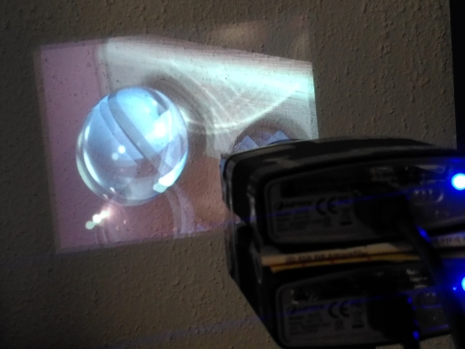
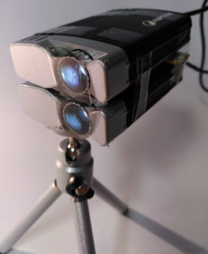

# DIY stereo image projector
## based on two Aiptek T20 USB projectors

This is a simple 3d projector based on two small Aiptek T20 USB
projectors. The two projectors are stacked onto each other and two
small parts of polarizer cut from cheap/thin polarizer glasses are
taped over the objective lenses of both projectors.



*Stereo image projected with two T20 projectors*

The image can be projected onto any surface that does not destroy
polarization like e.g. a silver screen or the matte side of a piece of
aluminum foil.



*Two stacked T20's*

## UDEV

To give regular applications the permissions to connect to the
T20's via USB a udev rule file is provided [here](udev/45-t20.rules).
Copy this file to ```/etc/udev/rules.d```.

## Viewer

The viewer serves two purposes. It can be used to test a single or
both projectors and it allows for benchmarking to verify that the
refresh rate is sufficient even for both projectors in parallel.

Example stereo images can e.g. be taken from
[StereoPOV](http://stereopov.ichthyostega.de/images.html).

The shell scripts in [viewer](viewer) allow to display single images
or stereo images either from "crossed eye" source or from regular
stereo sources.

```
$ ./view_stereo.sh photonBoxx_full.jps 
-- Aiptek T20 demo application --
Found device on bus 2 device 116.
0xfc01: 02
0xfc6c.w: 3031
0xfc6c.w: 1021
0xfc6c.w: 3021
0xfc6c.w: 3031
0xfc6c.w: 3021
ok
Found device on bus 1 device 89.
0xfc01: 02
0xfc6c.w: 0001
0xfc6c.w: 1001
0xfc6c.w: 3021
0xfc6c.w: 3031
0xfc6c.w: 3021
ok
Running 250 frame performance test ... 5.36s
Bytes/sec = 85986191 (656 mbit/s)
  => 46.650494 frames/sec
```